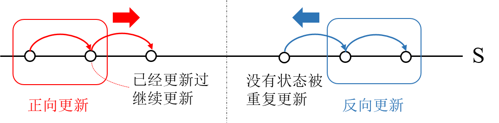
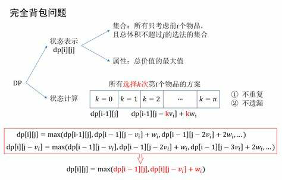
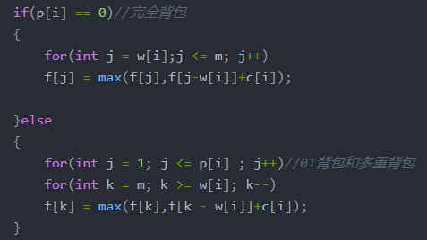

# 背包问题

​	n件物品，每件物品具有质量m和价值v，在不超过背包总重量M的基础上追求所携最大物品价值
$$
\begin{aligned}
\max \sum_{i=1}^nv_iu_i\\
s.t.\sum_{i=1}^nm_iu_i\le &M\\
\end{aligned}
$$
​	看作动态规划问题，装入n件物品看作n道工序，不妨从第n件物品装到第1件物品，逆推法从后向前不断得到前k件物品的最大价值$dp_{1:k}$，最后$dp_{1:n}$​​就是答案。示意图如下：

​	根据决策变量$u_{k}$​​的决策集合$D_k(s_k)$​不同可依次分为如下问题​：

## 01背包

$$
\begin{aligned}
D_k(s_k)&=\{0·m_k,1·m_k\}\\
V_k(s_k)&=u_kv_k
\end{aligned}
$$

​	每种物件只能选择要么取要么不取，本质是0-1规划问题。核心递推方程：
$$
\begin{aligned}
dp[s_{k+1}]&=\underset{u_k\in\{0,1\}}  \max  \{v(u_k)+dp[s_{k}]\}\\
s_{k+1} &= s_{k}-m_ku_k\\
v(u_k)&=u_kv_k
\end{aligned}
$$
​	第k个阶段的状态量$s_k$都默认是0~M，因此遍历0-M整个状态空间更新dp数组。注意反向更新适用于01背包仅更新一次，正向更新适用于完全背包需要若干次更新。下图对比两种更新方式，箭头表示用$s_k$更新$s_{k+1}$​。

> 例题：https://www.luogu.com.cn/problem/P1048

## 多重背包

​	每种物品有p件，决策集合发生改变
$$
D_k(s_k)=\{0·m_k,1·m_k…p_k·m_k\}
$$
​	可看作p个重量和价值相同的物品，转化成01背包问题

## 完全背包

​	每种物品可以带任意件，不能超过总质量上限
$$
D_k(s_k)=\{0·m_k,1·m_k…\lfloor\frac{M}{m_k}\rfloor·m_k\}
$$
​	如01背包中所说，将dp[s]由反向更新改为正向更新即可，其余同01背包，推导如下

> 例题：https://www.luogu.com.cn/problem/P1616
## 分组背包

​	物品分为若干组，每组中只能选择一个物品或不选。

​	思路类似01背包，在每组内多加一个循环比较组内选哪件物品最好。

> 最容易错的就是**循环次序**：每组（最外层循环）$\to$反向遍历更新状态（每组内看成01背包）$\to$​组内每件（组内的若干件中只能选择1件/0件，这是最内层循环）
>
> 例题：https://www.luogu.com.cn/problem/P1757

## 混合背包

​	前几种情况同时出现的背包问题，分情况讨论解决

## 依赖背包

​	待补充
